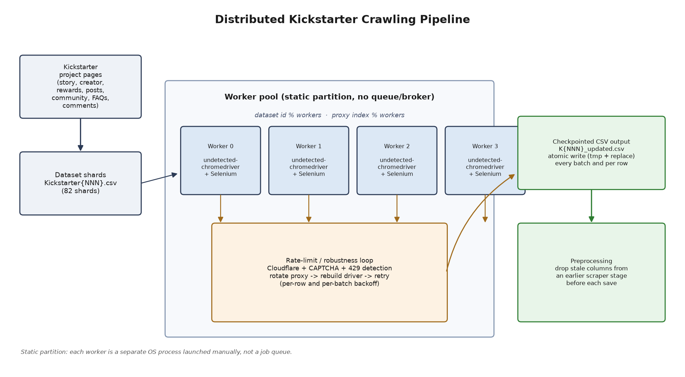

# Distributed Kickstarter Crawling Pipeline

A distributed Python pipeline for collecting structured data from Kickstarter project
pages: campaign story, creator profile, rewards, updates, community stats, FAQs and
comments. Built as a research assistant project at the University of New Mexico,
Anderson School of Management, between August and December 2025, to support a
large-scale analysis of Kickstarter campaign behavior and market trends.

This repository contains the pipeline code and architecture, not the collected
dataset. See [Data availability](#data-availability) below.

## Architecture



Work is split across a fixed number of worker processes, launched manually as
separate OS processes (no job queue or broker). Each worker is assigned:

- a slice of the dataset shards, by `dataset_id % workers`
- a slice of the proxy pool, by `proxy_index % workers`

Inside a worker, `undetected-chromedriver` drives a real Chrome instance per project
page (the site is JS-rendered and Cloudflare-protected, so a plain HTTP client isn't
enough). A rate-limit and robustness loop watches every page load for Cloudflare
challenges, CAPTCHAs, and HTTP 429s (read directly off Chrome's DevTools performance
log, not inferred), and reacts by rotating to the next proxy and rebuilding the
browser session before retrying. Progress is checkpointed to CSV after every row and
every batch, with atomic writes (write to a temp file, then replace), so a crash or
manual interrupt loses at most one row of work.

## Design decisions

**Why distributed at all.** Kickstarter pages are heavy (JS-rendered, several
sub-pages per project) and the site actively rate-limits and challenges automated
traffic. A single browser instance processing thousands of projects sequentially
would be both slow and easy to block. Splitting the dataset and the proxy pool across
independent processes bounds the blast radius of a block to one worker and lets
throughput scale roughly linearly with the number of workers and proxies available.

**Why static partitioning instead of a queue.** With a fixed, known set of dataset
shards and a fixed number of workers, a modulo-based static assignment is simpler to
operate than standing up a broker (Celery/Redis/RQ) for a project of this size, and
it makes the state of each worker fully self-contained: kill and restart any single
worker without touching the others.

**Rate limiting and robustness.** Kickstarter's rate limiting shows up in several
forms: a Cloudflare JS challenge, a CAPTCHA page, an HTML "throttled" message, or a
real HTTP 429 with a `Retry-After` header. The pipeline checks for all four after
every navigation and responds by rotating the proxy and rebuilding the browser
profile, rather than treating them as fatal errors. On top of that, each worker
rests between batches (`rest_seconds` after every `batch_size` rows) as a
self-imposed rate limit, independent of whatever Kickstarter enforces.

**Checkpointing over batching.** Because a single project page requires visiting six
sub-pages and can still fail partway through, results are written to disk after every
successful row, not just at the end of a dataset shard. This trades some I/O
overhead for the ability to resume a killed worker without losing more than the row
it was on.

## Stack

- Python 3.10+
- `undetected-chromedriver` + Selenium for browser automation
- `requests` for proxy IP verification and warmup only (not for scraping content)
- `pandas` for CSV I/O
- `PyYAML` for configuration

## Data flow and preprocessing

1. Input: `Kickstarter{NNN}.csv` shards in `data/raw/`, one row per project, each row
   carrying at least a `urls` column with the project's Kickstarter URL.
2. Each worker visits the project's story, creator, rewards, posts, community, FAQs
   and comments pages and appends the extracted fields to the row.
3. Rows are checkpointed to `K{NNN}_updated.csv` in `data/processed/` as they
   complete.
4. A small preprocessing step drops a handful of columns inherited from an earlier,
   no-longer-used stage of the input dataset (`src/pipeline.py::DROP_COLUMNS`) before
   each save, since this pipeline never populates them.

No separate cleaning/merging-of-shards script is part of this repository; combining
the 82 output shards into a single analysis dataset was done outside this codebase.

## Running it

```bash
python -m venv .venv
source .venv/bin/activate   # on Windows: .venv\Scripts\activate

pip install -r requirements.txt

cp config.example.yaml config.yaml       # edit as needed, never commit this file
cp proxies.example.json proxies.json     # fill in real proxies, never commit this file
```

`data/raw/Kickstarter001.csv` in this repo is a two-row illustrative example with
just the columns the pipeline actually depends on (`id`, `name`, `urls`), not a
sample of the real research dataset.

Run one worker per terminal (or background them), matching `--workers` across all of
them:

```bash
python main.py --worker-id 0 --workers 4 --dataset-start 1 --dataset-end 1
python main.py --worker-id 1 --workers 4 --dataset-start 1 --dataset-end 1
python main.py --worker-id 2 --workers 4 --dataset-start 1 --dataset-end 1
python main.py --worker-id 3 --workers 4 --dataset-start 1 --dataset-end 1
```

With only one dataset shard, only the worker whose id matches `1 % workers` will
have anything assigned to it; the others will exit immediately. Useful flags:
`--max-rows`, `--from-index` (resume), `--headless`, `--rotate-seconds`. Run
`python main.py --help` for the full list.

## Scale

The pipeline was run across 82 dataset shards during the research project at UNM.
This repository doesn't include logs or row counts from that run, so no total row
count is claimed here; the shard count and the code are what's verifiable from this
repository.

## Data availability

The Kickstarter campaign data collected with this pipeline was gathered as part of a
university research project and is not distributed in this repository, both because
it belongs to that research effort and because republishing scraped Kickstarter data
may conflict with Kickstarter's terms of service. This repository provides the code
and architecture only, plus a minimal illustrative input example
(`data/raw/Kickstarter001.csv`).

## Ethical and legal considerations

This pipeline automates browsing of a public website and was built for an academic
research purpose. A few things it does deliberately to be a reasonable citizen of
the site it scrapes:

- self-imposed rate limiting (batch rests, proxy rotation) independent of whatever
  Kickstarter enforces, rather than maximizing request rate
- backs off and retries rather than hammering a page that's already signaling it's
  rate-limited or challenging the client
- no attempt to bypass login, payment, or any non-public content; only publicly
  visible project pages are read

Scraping a site's public pages can still be in tension with its terms of service.
Anyone reusing this code against Kickstarter or another site should read that site's
terms and robots.txt, and make their own call about whether their use case is
appropriate.

## Repository structure

```
main.py                       CLI entrypoint
src/
  config.py                   Config dataclass, YAML loading
  utils.py                    small stateless helpers (backoff, scroll, colorized logs)
  proxy.py                    ProxyManager, proxy-backed requests session
  browser.py                  Chrome/undetected-chromedriver lifecycle, profile purging
  navigation.py               Cloudflare/CAPTCHA/429 detection, open-with-rotation
  extractors.py               per-page data extraction (story, creator, rewards, ...)
  pipeline.py                 dataset assignment, CSV I/O, the worker loop
config.example.yaml           example config, copy to config.yaml
proxies.example.json          example proxy list, copy to proxies.json
data/raw/                     input dataset shards (gitignored except the example)
data/processed/               worker output (gitignored)
figures/architecture.png      architecture diagram
scripts/generate_diagram.py   regenerates the diagram above
```

## License

The code in this repository is licensed under the MIT License (see `LICENSE`). The
license covers the code only. No Kickstarter data, scraped or otherwise, is included
in or covered by this license.
